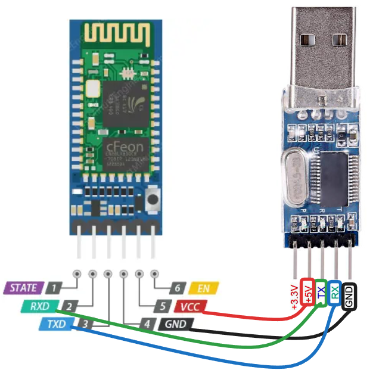
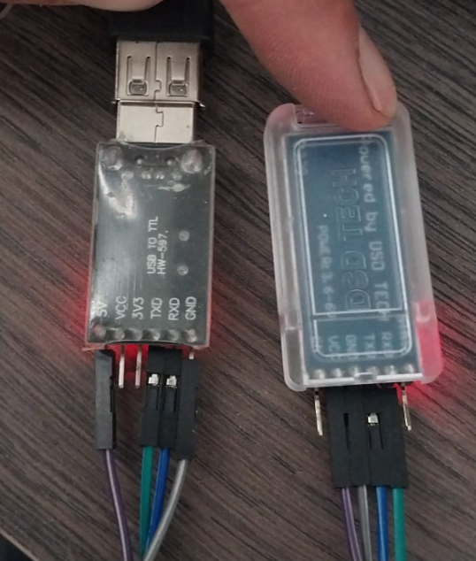
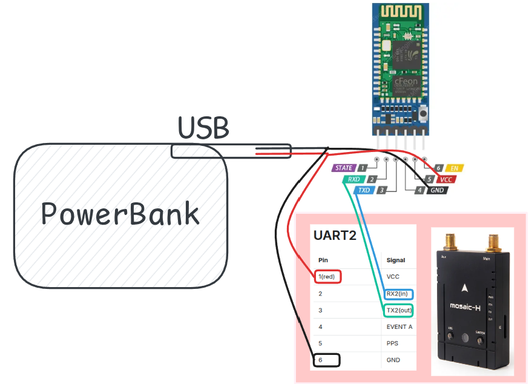
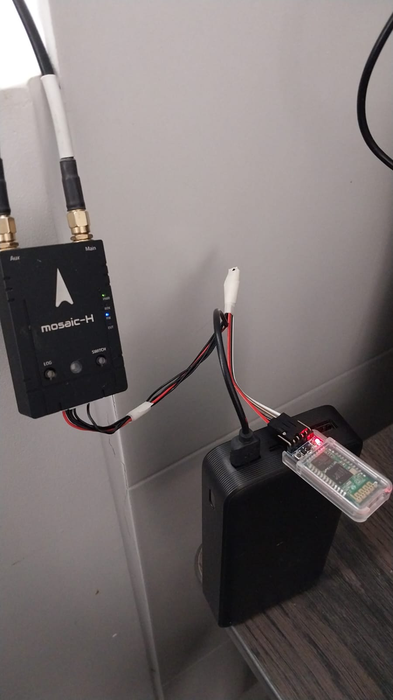
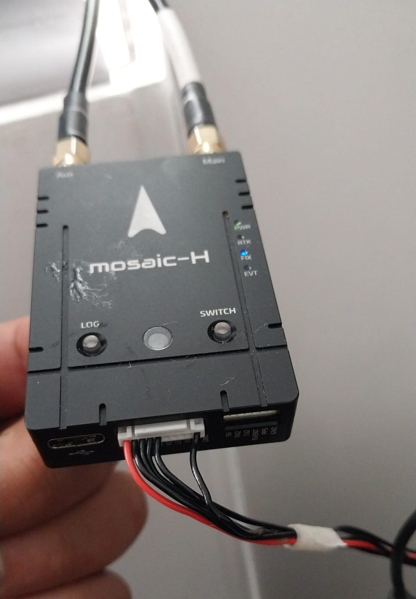

# Mosaic HC-05

This is a set of instructions to use hc-05 bluetooth modules with mosaic-h receivers

## Requirements

- 1x TTL to USB
- 1x HC05 Bluetooth module
- 1x Mosaic-H
- 1x Powerbank
- 1x Set of jumper wires

## HC-05 Configuration

In order to transmit the data stream from the mosaic receiver it is necessary to change the default HC-05 configuration from 9600 bauds to 115200.

This setting is done by using a ttl to USB adapter connected as shown bellow

<p align="center">
  
</p>
<p align="center">
  
</p>

In order to access to configuration mode, the button on the bluetooth module should be pressed for 4 seconds when powering on, then run the configuration script `./config.sh`

```bash
$ bash config.sh
```

in case the TTL to USB picks a different port or yuu can specify your port like this:

```bash
$ bash config.sh /dev/ttyUSB0
```

The following text should be displayed if it is successfully configured

```bash
[INFO] Using port: /dev/ttyUSB0
[INFO] Setting baud rate to 38400 (8N1, no echo)...
[INFO] Starting listener...
[TX] AT
[TX] AT+UART?
+UART:115200,0,0
OK
[TX] AT+UART=115200,0,0
OK
[TX] AT+UART?
+UART:115200,0,0
OK
[INFO] Stopping listener...
[DONE] Script finished.
```

## HC-05 and mosaic operation

Once the previous step is performed the following configuration is required:

<p align="center">
  
</p>
<p align="center">
  
</p>
<p align="center">
  
</p>

On linux, it is necessary to pair the bluetooth device, then we will pick the mac address from the HC-05 then associate to an specific port, from now on the bluetooth will automatically connect to the target PC.
