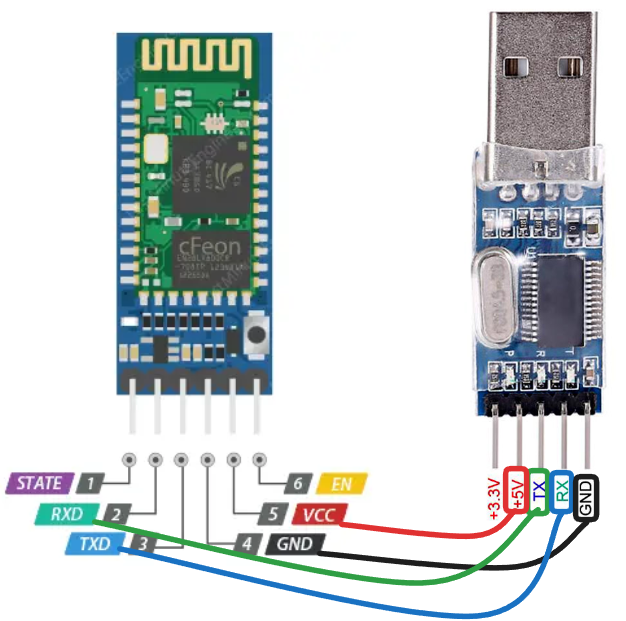
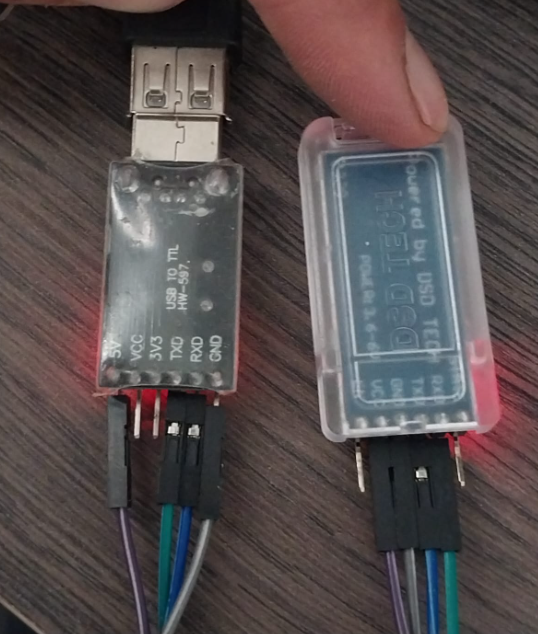
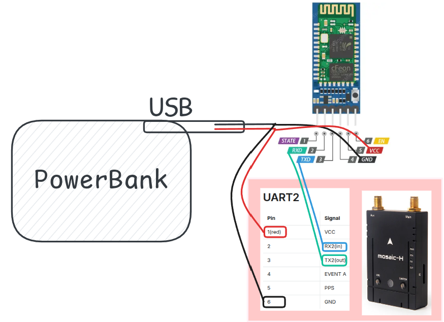
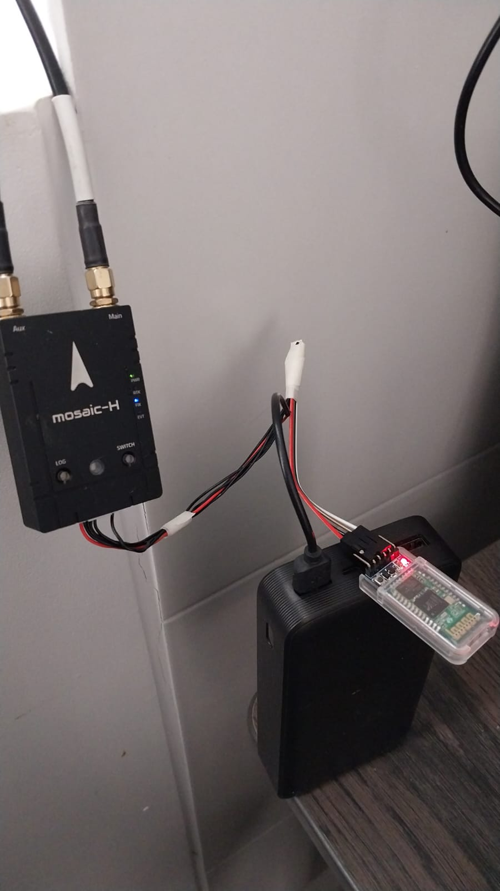
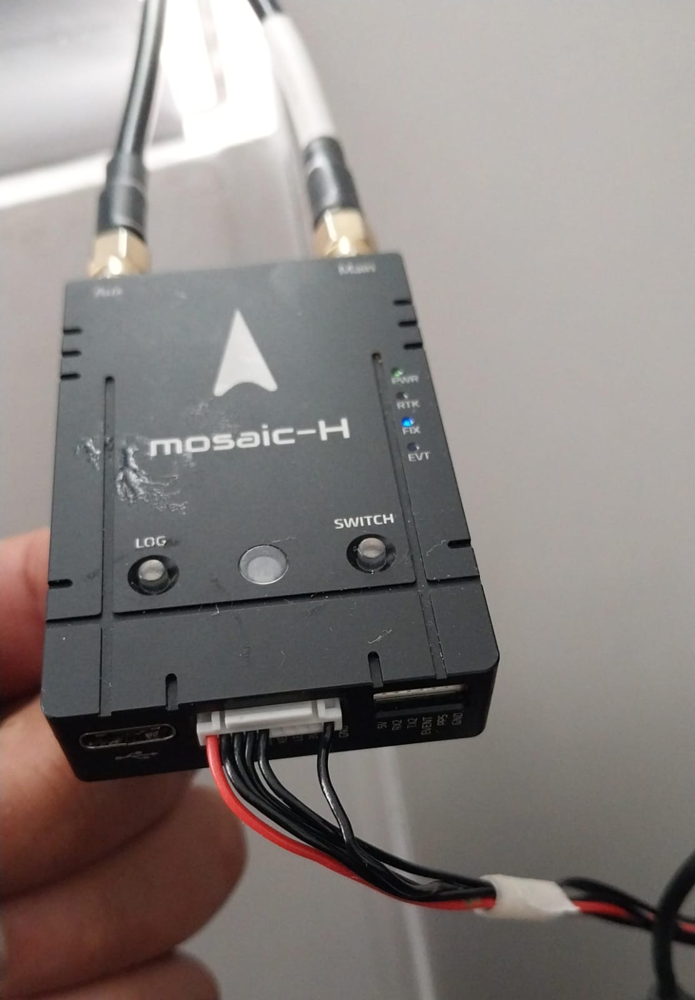

# Mosaic HC-05

This is a set of instructions to use hc-05 bluetooth modules with mosaic-h receivers

## Requirements

- 1x TTL to USB
- 1x HC05 Bluetooth module
- 1x Mosaic-H
- 1x Powerbank
- 1x Set of jumper wires

## HC-05 Configuration

In order to transmit the data stream from the mosaic receiver it is necessary to change the default HC-05 configuration from 9600 bauds to 115200.

This setting is done by using a ttl to USB adapter connected as shown bellow

<p align="center">
  
</p>
<p align="center">
  
</p>

In order to access to configuration mode, the button on the bluetooth module should be pressed for 4 seconds when powering on, then run the configuration script `./config.sh`

```bash
$ bash config.sh
```

in case the TTL to USB picks a different port or yuu can specify your port like this:

```bash
$ bash config.sh /dev/ttyUSB0
```

The following text should be displayed if it is successfully configured

```bash
[INFO] Using port: /dev/ttyUSB0
[INFO] Setting baud rate to 38400 (8N1, no echo)...
[INFO] Starting listener...
[TX] AT
[TX] AT+UART?
+UART:115200,0,0
OK
[TX] AT+UART=115200,0,0
OK
[TX] AT+UART?
+UART:115200,0,0
OK
[INFO] Stopping listener...
[DONE] Script finished.
```

## HC-05 and mosaic operation

Once the previous step is performed the following configuration is required:

<p align="center">
  
</p>
<p align="center">
  
</p>
<p align="center">
  
</p>

On linux, it is necessary to pair the bluetooth device, then we will pick the mac address from the HC-05 then associate to an specific port, from now on the bluetooth will automatically connect to the target PC.

## HC-05 Bluetooth link

After pairing, the MAC address should be associated to a rfcomm port as shown bellow

```bash
bluetoothctl devices # list devices and mac address
sudo rfcomm bind 0 BT_MAC_ADDRESS # this creates /dev/rfcomm0

```

## Mosaic-H receiver configuration

The receiver itself also needs to be configured so its output matches what
this project expects: RTCMv3 corrections coming in on COM1, and SBF
(`AttEuler` + `PVTGeodetic` + `PosCovGeodetic`) streamed out on USB1 every
200ms. The commands for this are in [`com1-usb1.txt`](./com1-usb1.txt).

Paste those lines, in order, into the receiver's command line (available
through its web interface or a serial terminal connected to COM1):

```bash
$ cat com1-usb1.txt
```

## Running the GNSS service

Install dependencies and start the server:

```bash
$ pnpm install
$ node api.js
```

Once running, open `http://localhost:10000` in a browser to see the live
terminal UI — ntrip and serial connection status, throughput in kbps, the
detected USB/serial devices, and the parsed GPS data stream.

## Building a standalone bundle

Use `compile.sh` to bundle the server into a single file with esbuild,
which is convenient for copying to the target device:

```bash
$ bash compile.sh
```

This produces `api_bundle.js`. `serialport` and `settings.json` stay
external (see `compile.sh`), so keep `node_modules` and `settings.json`
alongside it, then run it the same way:

```bash
$ node api_bundle.js
```
