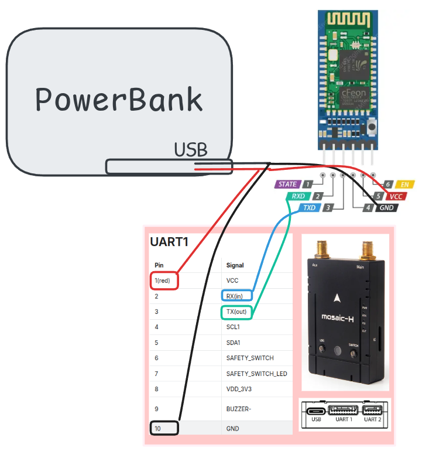

# Mosaic HC-05

This is a set of instructions to use hc-05 bluetooth modules with mosaic-h receivers

## Requirements

- 1x TTL to USB
- 1x HC05 Bluetooth module
- 1x Mosaic-H
- 1x Powerbank
- 1x Set of jumper wires

## HC-05 Configuration

In order to transmit the data stream from the mosaic receiver it is necessary to change the default HC-05 configuration from 9600 bauds to 115200.

This setting is done by using a ttl to USB adapter connected as shown bellow

<p align="center">
  
</p>
<p align="center">
  
</p>

In order to access to configuration mode, the button on the bluetooth module should be pressed for 4 seconds when powering on, then run the configuration script `./config.sh`

```bash
# config.sh

# Usage: ./config.sh [PORT]
# Example: ./config.sh /dev/ttyUSB1

# Default port
PORT=${1:-/dev/ttyUSB0}

# Initial baud rate
BAUD=38400

echo "[INFO] Using port: $PORT"
echo "[INFO] Setting baud rate to $BAUD (8N1, no echo)..."

# Configure the serial port
stty -F "$PORT" $BAUD cs8 -cstopb -parenb -echo raw
if [ $? -ne 0 ]; then
  echo "[ERROR] Failed to configure $PORT"
  exit 1
fi

# Function to send an AT command
send_cmd() {
  local CMD=$1
  echo "[TX] $CMD"
  echo -e "$CMD\r" > "$PORT"
  sleep 1
}

# Run cat in the background to show responses
echo "[INFO] Starting listener..."
cat < "$PORT" &
CAT_PID=$!

sleep 1

# Send commands
send_cmd "AT"
send_cmd "AT+UART?"
send_cmd "AT+UART=115200,0,0"
send_cmd "AT+UART?"

# Stop the listener
echo "[INFO] Stopping listener..."
kill $CAT_PID 2>/dev/null
wait $CAT_PID 2>/dev/null

echo "[DONE] Script finished."
```

```bash
$ bash config.sh
```

in case the TTL to USB picks a different port or yuu can specify your port like this:

```bash
$ bash config.sh /dev/ttyUSB0
```

The following text should be displayed if it is successfully configured

```bash
[INFO] Using port: /dev/ttyUSB0
[INFO] Setting baud rate to 38400 (8N1, no echo)...
[INFO] Starting listener...
[TX] AT
[TX] AT+UART?
+UART:115200,0,0
OK
[TX] AT+UART=115200,0,0
OK
[TX] AT+UART?
+UART:115200,0,0
OK
[INFO] Stopping listener...
[DONE] Script finished.
```

## HC-05 and mosaic operation

Once the previous step is performed the following configuration is required:

<p align="center">
  
</p>
<p align="center">
  
</p>
<p align="center">
  
</p>

On linux, it is necessary to pair the bluetooth device, then we will pick the mac address from the HC-05 then associate to an specific port, from now on the bluetooth will automatically connect to the target PC.
